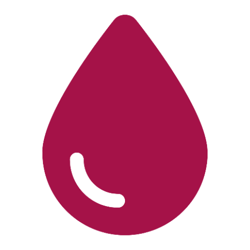

# 🩸 B Donor App — Blood Donation Android Application

<p align="center">
  
</p>

<p align="center">
  <b>Connecting blood donors with those in need — saving lives, one donation at a time.</b>
</p>

---

## 📌 About the Project

**B Donor App** is a real-world Android mobile application developed to address the critical shortage of blood donors in emergency medical situations. By digitising and streamlining the blood donation request and response process, the app bridges the gap between people urgently needing blood and willing donors in their area.

This project was developed as a **university project**, following **Object-Oriented Design (OOD)** principles and **Software Engineering (SE) best practices** to deliver a maintainable, scalable, and testable solution.

---

## 🎨 Figma Design (Prototype)

The UI/UX of this application was prototyped in Figma before development. The prototype covers all key screens including authentication flows, home feed, blood request creation, map view, and user profile.

> 🔗 **[View Figma Prototype]([https://www.figma.com/your-prototype-link-here](https://www.figma.com/design/6AYbKMgtldWMblmpbz6wOB/B-donor?node-id=0-1&t=soAzYKaWg1hl5TFO-1))**
>
> *(Replace the link above with your actual Figma prototype URL)*

---

## ✨ Features

- 🔐 **User Authentication** — Secure sign-up and login via Firebase Authentication
- 📋 **Blood Requests** — Create, view, and respond to urgent/normal blood donation requests
- 🗺️ **Map View** — Locate blood requests and donors on an interactive Google Map
- 🔔 **Push Notifications** — Receive real-time alerts for new blood requests via Firebase Cloud Messaging
- 👤 **User Profile** — Manage personal details including blood type, city, and profile picture
- 🏠 **Home Feed** — Browse all active blood requests with urgency indicators
- 📂 **My Requests** — Track requests you have posted or accepted

---

## 🏗️ Architecture & OOD Concepts

The application follows a clean **MVC-inspired layered architecture**, adhering to the following Object-Oriented Design concepts:

| OOD Concept | Implementation |
|---|---|
| **Encapsulation** | Model classes (`User`, `BloodRequest`) expose data only through getters and setters |
| **Abstraction** | Controller interfaces (`OnUserDataLoadedListener`, `RequestCallback`) abstract data-loading operations from UI |
| **Separation of Concerns** | Distinct packages for Models, Controllers, Adapters, UI Fragments, and Authentication |
| **Single Responsibility** | Each class has one clearly defined responsibility (e.g., `UserDataManager` handles only user data operations) |
| **Reusability** | `BloodRequestAdapter` is reused across multiple list views |

### 📁 Package Structure

```
com.ashen.bdonorapp/
├── Models/                  # Data models: User, BloodRequest
├── Controller/              # Business logic & data managers
│   ├── UserDataManager
│   ├── RequestDataManager
│   ├── OnUserDataLoadedListener
│   ├── OnUserDataUpdateListener
│   └── RequestCallback
├── Adapters/                # RecyclerView adapters
│   └── BloodRequestAdapter
├── RequestModule/           # Blood request screens
│   ├── AddBloodRequestActivity
│   ├── RequestDetailsActivity
│   └── OwnerReqDetailsActivity
├── UI/                      # Fragments for main navigation
│   ├── HomeFragment
│   ├── MapPageFragment
│   ├── RequestPageFragment
│   ├── AllRequestFragment
│   ├── UserRequestFragment
│   ├── ProfilePageFragment
│   └── EditUserProfile
├── authenticationModule/    # Auth screens
│   ├── LoginActivity
│   └── RegisterActivity
├── MainActivity             # App entry point with navigation
└── SplashScreen             # Launch screen
```

---

## 🛠️ Tech Stack

| Category | Technology |
|---|---|
| **Platform** | Android (API 24+) |
| **Language** | Java |
| **Build System** | Gradle (Kotlin DSL) |
| **Backend / Database** | Firebase Firestore |
| **Authentication** | Firebase Authentication |
| **Push Notifications** | Firebase Cloud Messaging (FCM) |
| **Maps** | Google Maps SDK & Places API |
| **Location** | Google Play Services Location |
| **Networking** | Retrofit 2 + OkHttp 3 |
| **UI Components** | Material Design, CardView, ViewBinding |
| **Responsive Design** | SDP / SSP (Scalable Size Units) |
| **Image Views** | RoundedImageView |

---

## 🔧 SE Best Practices Applied

- **Version Control** — Git with feature branching
- **Layered Architecture** — Clear separation between data, business logic, and presentation layers
- **ViewBinding** — Type-safe view access, eliminating `NullPointerException` risks from `findViewById`
- **Listener Interfaces** — Callback-based asynchronous data loading to decouple UI from data sources
- **Firebase Security Rules** — Backend data access controlled at the database level
- **ProGuard Configuration** — Code obfuscation support for release builds
- **Instrumented & Unit Testing** — Test infrastructure with JUnit and Espresso

---

## 🚀 Getting Started

### Prerequisites

- Android Studio (Hedgehog or later recommended)
- A Firebase project with Firestore, Authentication, and Cloud Messaging enabled
- A Google Maps API key

### Setup

1. **Clone the repository**
   ```bash
   git clone https://github.com/AshenFdo/Blood-Donation-app.git
   cd Blood-Donation-app
   ```

2. **Add Firebase configuration**
   - Download `google-services.json` from your Firebase Console
   - Place it in the `app/` directory

3. **Add your Google Maps API key**
   - Open `app/src/main/res/values/strings.xml`
   - Set the value for `my_api_key`

4. **Build and run**
   - Open the project in Android Studio
   - Sync Gradle and run on an emulator or physical device (API 24+)

---

## 📸 Screenshots

> *(Add screenshots of the app here to give viewers a visual overview)*

| Splash Screen | Login | Home | Blood Request |
|---|---|---|---|
| *screenshot* | *screenshot* | *screenshot* | *screenshot* |

---

## 🤝 Contributing

This is a university project. Contributions, suggestions, and feedback are welcome. Feel free to open an issue or submit a pull request.

---

## 📄 License

This project is for educational purposes. All rights reserved © AshenFdo.
